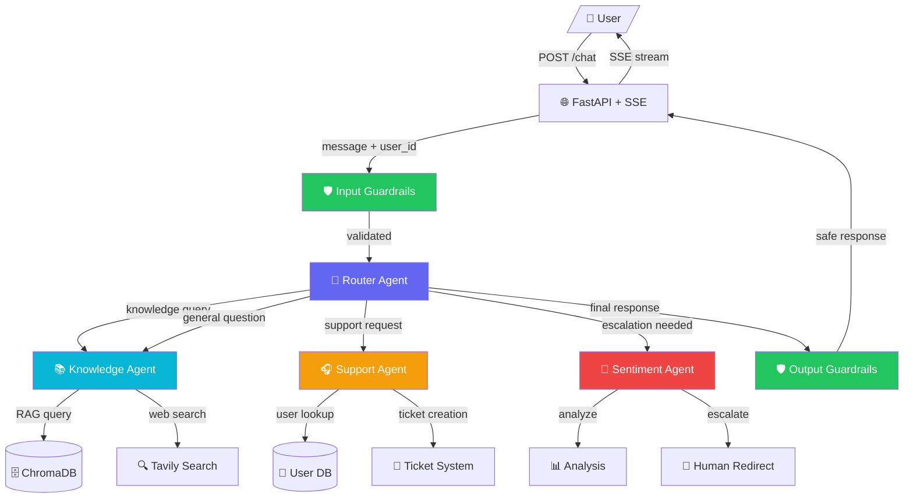

# Agent Swarm – CloudWalk / InfinitePay Coding Challenge

## Goal

Build a production-grade, multi-agent AI system that processes user inquiries about InfinitePay products, provides customer support, answers general questions via web search, and demonstrates advanced engineering practices (guardrails, RAG, testing, containerization).

The system must **over-deliver** on every requirement — more agents, more tools, better guardrails, premium frontend, and comprehensive documentation.

---

## Technology Decisions

| Layer | Technology | Rationale |
|---|---|---|
| **Language** | Python 3.12 | Most mature AI/ML ecosystem; LangGraph is Python-native; best framework support |
| **Agent Orchestration** | LangGraph (manual supervisor pattern) | Industry leader for stateful multi-agent workflows; more control than `langgraph-supervisor` library |
| **API** | FastAPI + SSE Streaming | Async-first, auto-docs, SSE for streaming agent responses (better than WebSocket for this use case) |
| **LLMs** | GPT-4o-mini (Router, RAG); Claude Sonnet 4 (Support, Complex); Gemini 2.5 Flash (Guardrails) | Cost-optimized model selection per agent complexity |
| **Vector DB** | ChromaDB (embedded) | Lightweight, Docker-friendly, perfect for this scope; no external infra needed |
| **Embeddings** | OpenAI `text-embedding-3-small` | High quality, cost-effective, 1536 dimensions |
| **Web Search** | Tavily Search API | Purpose-built for LLM agents, returns clean structured content |
| **Guardrails** | NVIDIA NeMo Guardrails + Custom prompt engineering | Input/output rails, jailbreak detection, topic enforcement |
| **Testing** | pytest + promptfoo | pytest for unit/integration; promptfoo for prompt quality evaluation & red-teaming |
| **Scraping** | `crawl4ai` or `BeautifulSoup` + `httpx` | For ingesting InfinitePay website content into RAG |
| **Frontend** | Single-page HTML/CSS/JS chat UI | Premium glassmorphism design with SSE streaming |
| **Containerization** | Docker + docker-compose | Multi-stage builds, health checks |
| **Dependency Management** | `pyproject.toml` + `uv` | Modern Python packaging |

---

## User Review Required

> [!IMPORTANT]
> **API Keys Required**: You'll need to provide or have available:
> - `OPENAI_API_KEY` — for embeddings + GPT-4o-mini
> - `ANTHROPIC_API_KEY` — for Claude Sonnet 4 (Customer Support agent)
> - `TAVILY_API_KEY` — for web search (free tier: 1000 calls/month)
> - (Optional) `GOOGLE_API_KEY` — for Gemini Flash in guardrails
> 
> If you prefer to use only one provider (e.g., only OpenAI), I can adjust all agents to use OpenAI models instead.

> [!WARNING]
> **Multi-LLM Strategy**: The plan uses different LLMs for different agents to showcase model selection skills. However, this increases API key requirements. Confirm if you want:
> - **Option A**: Multi-provider (OpenAI + Anthropic + Gemini) — demonstrates advanced model selection
> - **Option B**: Single-provider (OpenAI only, with GPT-4o-mini and GPT-4o) — simpler setup
> - **Option C**: Your preferred combination

> [!IMPORTANT]
> **4th Agent Choice**: I propose a **Sentiment Analysis & Escalation Agent** that:
> - Analyzes user sentiment in real-time
> - Detects frustration/urgency and triggers human escalation
> - Logs escalation events with context summaries
> - Acts as the "Redirect to Human" bonus feature
> 
> Alternatively, we could do a **Slack Agent** or something else. What do you prefer?

---

## Architecture Overview



### Agent Responsibilities & Tools

#### 🧠 Agent 1: Router Agent (Supervisor)
- **Model**: GPT-4o-mini (fast, cheap, good at classification)
- **Role**: Classifies intent, routes to specialized agents, aggregates responses  
- **Tools**:
  1. `classify_intent` — Determines message category (knowledge, support, general, escalation)
  2. `route_to_agent` — Handoff mechanism to delegate to a sub-agent
  3. `detect_language` — Identifies user language for localized responses
  4. `summarize_conversation` — Creates context summary for agent handoffs

#### 📚 Agent 2: Knowledge Agent (RAG + Web Search)
- **Model**: GPT-4o-mini (retrieval tasks don't need heavy reasoning)
- **Role**: Answers questions about InfinitePay products using RAG, and general questions via web search
- **Tools**:
  1. `search_knowledge_base` — Vector similarity search against ChromaDB
  2. `search_web` — Tavily web search for general/current-event questions
  3. `extract_product_info` — Structured extraction of product details (prices, features, rates)
  4. `compare_products` — Compare features between InfinitePay products

#### 🎧 Agent 3: Customer Support Agent
- **Model**: Claude Sonnet 4 (excellent at empathetic, nuanced responses)
- **Role**: Handles account issues, troubleshooting, and support tickets
- **Tools**:
  1. `lookup_user` — Retrieve user account data from simulated DB
  2. `get_transaction_history` — Fetch recent transactions
  3. `create_support_ticket` — Log a support case
  4. `check_service_status` — Check if InfinitePay services are operational
  5. `reset_password_request` — Initiate password reset flow
  6. `get_account_balance` — Retrieve account balance and limits

#### 💬 Agent 4: Sentiment & Escalation Agent (Bonus)
- **Model**: GPT-4o-mini (fast sentiment classification)
- **Role**: Real-time sentiment analysis, frustration detection, human handoff
- **Tools**:
  1. `analyze_sentiment` — Score message sentiment (-1 to 1)
  2. `detect_urgency` — Classify urgency level (low/medium/high/critical)
  3. `escalate_to_human` — Trigger human redirect with full context
  4. `generate_escalation_summary` — Create a brief for the human agent

---

## Proposed Changes

### Project Structure

```
infinity-agent/
├── src/
│   ├── __init__.py
│   ├── main.py                          # FastAPI app entry point
│   ├── config.py                        # Settings, env vars (Pydantic Settings)
│   │
│   ├── api/
│   │   ├── __init__.py
│   │   ├── v1/
│   │   │   ├── __init__.py
│   │   │   ├── routes/
│   │   │   │   ├── __init__.py
│   │   │   │   ├── chat.py              # POST /v1/chat (main endpoint)
│   │   │   │   ├── health.py            # GET /v1/health
│   │   │   │   └── knowledge.py         # GET /v1/knowledge/status (RAG status)
│   │   │   └── schemas.py              # Request/Response Pydantic models
│   │   ├── middleware.py               # CORS, logging, rate limiting
│   │   └── deps.py                     # Shared dependencies
│   │
│   ├── agents/
│   │   ├── __init__.py
│   │   ├── graph.py                    # LangGraph StateGraph definition (the swarm)
│   │   ├── state.py                    # Shared state schema (TypedDict/Pydantic)
│   │   ├── router/
│   │   │   ├── __init__.py
│   │   │   ├── agent.py                # Router agent node logic
│   │   │   └── prompts.py              # Router system prompts
│   │   ├── knowledge/
│   │   │   ├── __init__.py
│   │   │   ├── agent.py                # Knowledge agent node logic
│   │   │   └── prompts.py              # Knowledge system prompts
│   │   ├── support/
│   │   │   ├── __init__.py
│   │   │   ├── agent.py                # Customer Support agent node logic
│   │   │   └── prompts.py              # Support system prompts
│   │   └── sentiment/
│   │       ├── __init__.py
│   │       ├── agent.py                # Sentiment & Escalation agent node logic
│   │       └── prompts.py              # Sentiment system prompts
│   │
│   ├── tools/
│   │   ├── __init__.py
│   │   ├── knowledge_tools.py          # search_knowledge_base, search_web, etc.
│   │   ├── support_tools.py            # lookup_user, create_ticket, etc.
│   │   ├── sentiment_tools.py          # analyze_sentiment, escalate, etc.
│   │   └── router_tools.py            # classify_intent, detect_language, etc.
│   │
│   ├── rag/
│   │   ├── __init__.py
│   │   ├── ingest.py                   # Web scraping + chunking + embedding pipeline
│   │   ├── retriever.py                # ChromaDB retrieval logic
│   │   ├── embeddings.py              # Embedding model wrapper
│   │   └── chunking.py                 # Text splitting strategies
│   │
│   ├── guardrails/
│   │   ├── __init__.py
│   │   ├── input_guard.py              # Input validation, injection detection
│   │   ├── output_guard.py             # Output safety, PII filtering
│   │   ├── topic_guard.py              # Topic boundary enforcement
│   │   └── config/
│   │       ├── config.yml              # NeMo Guardrails config
│   │       └── rails.co                # Colang guardrail definitions
│   │
│   ├── db/
│   │   ├── __init__.py
│   │   ├── fake_users.py               # Simulated user database
│   │   └── fake_tickets.py             # Simulated ticket system
│   │
│   └── utils/
│       ├── __init__.py
│       ├── logging.py                  # Structured logging setup
│       └── streaming.py                # SSE streaming helpers
│
├── frontend/
│   ├── index.html                      # Chat UI
│   ├── styles.css                      # Premium glassmorphism CSS
│   └── app.js                          # SSE client + chat logic
│
├── tests/
│   ├── __init__.py
│   ├── conftest.py                    # Pytest fixtures
│   ├── unit/
│   │   ├── test_router_agent.py
│   │   ├── test_knowledge_agent.py
│   │   ├── test_support_agent.py
│   │   ├── test_sentiment_agent.py
│   │   ├── test_guardrails.py
│   │   └── test_rag_pipeline.py
│   ├── integration/
│   │   ├── test_api_endpoints.py
│   │   └── test_agent_swarm.py
│   └── promptfoo/
│       ├── promptfooconfig.yaml        # Prompt evaluation config
│       ├── prompts/                    # Prompt templates under test
│       └── datasets/                   # Test datasets
│
├── scripts/
│   ├── ingest_knowledge.py            # One-shot script to populate ChromaDB
│   └── seed_fake_data.py              # Seed fake user/ticket data
│
├── data/
│   └── chroma_db/                     # ChromaDB persistent storage (gitignored)
│
├── Dockerfile
├── docker-compose.yml
├── pyproject.toml
├── .env.example
├── .gitignore
└── README.md                          # Comprehensive documentation
```

---

### Component Details

---

#### Core: Config & Entry Point

##### [NEW] `src/config.py`
- Pydantic Settings class loading from `.env`
- API keys, model names, ChromaDB path, guardrail settings
- Feature flags (enable/disable guardrails, streaming, etc.)

##### [NEW] `src/main.py`
- FastAPI application factory
- Mount static files (frontend)
- Include API routers
- Startup events: initialize ChromaDB, validate API keys
- CORS middleware setup

---

#### API Layer

##### [NEW] `src/api/v1/routes/chat.py`
- `POST /v1/chat` — Main endpoint accepting `{message, user_id}`
- Returns JSON response with agent result
- Optional: `POST /v1/chat/stream` — SSE streaming endpoint
- Includes request validation, error handling, response formatting

##### [NEW] `src/api/v1/routes/health.py`
- `GET /v1/health` — Service health check
- Checks LLM connectivity, ChromaDB status, API key validity

##### [NEW] `src/api/v1/schemas.py`
- `ChatRequest`: message (str), user_id (str)
- `ChatResponse`: response (str), agent_used (str), metadata (dict)
- `StreamEvent`: event type + data for SSE

---

#### Agent Swarm (LangGraph)

##### [NEW] `src/agents/state.py`
- `AgentState(TypedDict)` with:
  - `messages: Annotated[list[AnyMessage], add_messages]`
  - `user_id: str`
  - `intent: str` (classified intent)
  - `agent_route: str` (which agent to call)
  - `sentiment_score: float`
  - `escalated: bool`
  - `guardrail_flags: dict`
  - `metadata: dict`

##### [NEW] `src/agents/graph.py`
- LangGraph `StateGraph` definition
- Nodes: `input_guard` → `router` → `{knowledge, support, sentiment}` → `output_guard` → `respond`
- Conditional edges based on `router` classification
- Compiled graph with checkpointer (optional for conversation memory)

##### [NEW] `src/agents/router/agent.py`
- Router node function
- Uses GPT-4o-mini with tool-calling to classify intent
- Returns `Command` to goto the appropriate agent node

##### [NEW] `src/agents/router/prompts.py`
- High-quality system prompt defining:
  - Available agent capabilities
  - Classification categories with examples
  - Language detection instructions
  - Edge case handling

##### [NEW] `src/agents/knowledge/agent.py`
- Knowledge agent node
- Decision logic: use RAG for InfinitePay questions, Tavily for general questions
- Response synthesis with source citations

##### [NEW] `src/agents/knowledge/prompts.py`
- System prompt enforcing:
  - Grounding in retrieved context
  - Source citation format
  - Handling of "I don't know" cases
  - Bilingual support (PT-BR / EN)

##### [NEW] `src/agents/support/agent.py`
- Customer support agent node
- Tool-calling for user lookup, ticket creation, troubleshooting
- Empathetic response generation

##### [NEW] `src/agents/support/prompts.py`
- Support agent system prompt:
  - Company tone and values
  - Troubleshooting decision trees
  - Escalation criteria
  - Privacy-aware responses

##### [NEW] `src/agents/sentiment/agent.py`
- Sentiment analysis + escalation agent node
- Evaluates entire conversation sentiment
- Triggers human redirect if frustration detected

##### [NEW] `src/agents/sentiment/prompts.py`
- Sentiment agent system prompt:
  - Scoring criteria
  - Escalation thresholds
  - Summary generation format

---

#### Tools

##### [NEW] `src/tools/knowledge_tools.py`
- `search_knowledge_base(query: str, k: int = 5)` — ChromaDB similarity search
- `search_web(query: str)` — Tavily web search
- `extract_product_info(product_name: str)` — Structured product data extraction
- `compare_products(product_a: str, product_b: str)` — Side-by-side comparison

##### [NEW] `src/tools/support_tools.py`
- `lookup_user(user_id: str)` — Get user profile from fake DB
- `get_transaction_history(user_id: str, limit: int)` — Recent transactions
- `create_support_ticket(user_id: str, issue: str, priority: str)` — Create ticket
- `check_service_status()` — Service health for all InfinitePay products
- `reset_password_request(user_id: str)` — Password reset initiation
- `get_account_balance(user_id: str)` — Balance and limits

##### [NEW] `src/tools/sentiment_tools.py`
- `analyze_sentiment(text: str)` — Sentiment score (-1 to 1)
- `detect_urgency(text: str)` — Urgency classification
- `escalate_to_human(user_id: str, context: str)` — Human handoff
- `generate_escalation_summary(messages: list)` — Context brief

##### [NEW] `src/tools/router_tools.py`
- `classify_intent(message: str)` — Intent classification
- `detect_language(text: str)` — Language detection
- `summarize_conversation(messages: list)` — Context summary
- `route_to_agent(agent_name: str)` — Handoff mechanism

---

#### RAG Pipeline

##### [NEW] `src/rag/ingest.py`
- Async web scraping of all InfinitePay URLs
- HTML → clean text extraction
- Metadata extraction (page title, URL, section)
- Batch ingestion into ChromaDB

##### [NEW] `src/rag/chunking.py`
- `RecursiveCharacterTextSplitter` with optimal chunk sizes (512-1024 tokens)
- Overlap of 100 tokens for context continuity
- Metadata preservation per chunk

##### [NEW] `src/rag/retriever.py`
- ChromaDB collection management
- Similarity search with metadata filtering
- Re-ranking with relevance scoring
- Multi-query retrieval for better recall

##### [NEW] `src/rag/embeddings.py`
- OpenAI `text-embedding-3-small` wrapper
- Batch embedding for ingestion
- Cache layer for repeated queries

---

#### Guardrails

##### [NEW] `src/guardrails/input_guard.py`
- Prompt injection detection (regex patterns + LLM-based)
- Jailbreak attempt blocking
- Content moderation (hate speech, violence, etc.)
- Topic boundary enforcement (only InfinitePay-related or general knowledge)

##### [NEW] `src/guardrails/output_guard.py`
- PII detection and masking in responses
- Hallucination check (verify claims against RAG context)
- Response relevance validation
- Toxicity filtering

##### [NEW] `src/guardrails/topic_guard.py`
- Allowlisted topics: InfinitePay products, general knowledge, customer support
- Blocklisted topics: competitor products, financial advice, illegal activities
- Graceful deflection responses

##### [NEW] `src/guardrails/config/`
- NeMo Guardrails configuration (Colang files)
- Rail definitions for input/output/dialog

---

#### Frontend

##### [NEW] `frontend/index.html`
- Single-page chat application
- SSE streaming for real-time agent responses
- Agent identification badges (which agent is responding)
- Typing indicators, message timestamps

##### [NEW] `frontend/styles.css`
- Dark mode glassmorphism design
- Gradient accents matching InfinitePay green (#00E676 → #00BCD4)
- Smooth animations (slide-in messages, fade transitions)
- Mobile-responsive layout
- Agent-specific color coding

##### [NEW] `frontend/app.js`
- SSE client for streaming responses
- Message rendering with Markdown support
- Auto-scroll, typing indicators
- Error handling and reconnection

---

#### Testing

##### [NEW] `tests/unit/test_router_agent.py`
- Test intent classification accuracy
- Test routing decisions for each agent
- Test edge cases (ambiguous messages, empty messages)

##### [NEW] `tests/unit/test_knowledge_agent.py`
- Test RAG retrieval relevance
- Test web search fallback
- Test response grounding in context

##### [NEW] `tests/unit/test_support_agent.py`
- Test tool invocations (user lookup, ticket creation)
- Test empathetic response quality

##### [NEW] `tests/unit/test_guardrails.py`
- Test prompt injection detection
- Test PII masking
- Test topic boundary enforcement

##### [NEW] `tests/integration/test_api_endpoints.py`
- FastAPI TestClient tests
- Full request/response cycle
- Error handling scenarios

##### [NEW] `tests/promptfoo/promptfooconfig.yaml`
- Prompt evaluation for each agent
- Comparative testing across model versions
- Red-teaming for guardrails

---

#### Infrastructure

##### [NEW] `Dockerfile`
- Multi-stage build (builder → runtime)
- Python 3.12 slim base
- Non-root user
- Health check endpoint

##### [NEW] `docker-compose.yml`
- Service: `infinity-agent` (the app)
- Volume mount for ChromaDB data persistence
- Environment variables from `.env`
- Port mapping (8000)
- Optional: `chroma` service if using client/server mode

##### [NEW] `pyproject.toml`
- Project metadata
- Dependencies with version pinning
- Dev dependencies (pytest, promptfoo, ruff, mypy)
- Scripts: `dev`, `test`, `ingest`, `lint`

##### [NEW] `.env.example`
- Template for all required environment variables

##### [NEW] `README.md`
- Architecture overview with Mermaid diagram
- Setup instructions (local + Docker)
- API documentation
- RAG pipeline description
- Testing strategy
- Agent descriptions and workflow
- How LLM tools were leveraged

---

## LangGraph Flow Detail

The supervisor pattern will work as follows:

```python
# Simplified graph structure
from langgraph.graph import StateGraph, START, END

graph = StateGraph(AgentState)

# Add nodes
graph.add_node("input_guard", input_guardrail_node)
graph.add_node("router", router_agent_node)
graph.add_node("knowledge", knowledge_agent_node)
graph.add_node("support", support_agent_node)
graph.add_node("sentiment", sentiment_agent_node)
graph.add_node("output_guard", output_guardrail_node)

# Add edges
graph.add_edge(START, "input_guard")
graph.add_edge("input_guard", "router")
graph.add_conditional_edges(
    "router",
    route_by_intent,  # function that reads state.intent
    {
        "knowledge": "knowledge",
        "support": "support",
        "escalation": "sentiment",
    }
)
graph.add_edge("knowledge", "output_guard")
graph.add_edge("support", "output_guard")
graph.add_edge("sentiment", "output_guard")
graph.add_edge("output_guard", END)

swarm = graph.compile()
```

---

## Open Questions

> [!IMPORTANT]
> 1. **LLM Provider Preference**: Multi-provider (Option A) vs single-provider (Option B)? See details in "User Review Required" section above.

> [!IMPORTANT]
> 2. **4th Agent**: Sentiment & Escalation Agent (my recommendation) or something else (Slack Agent, etc.)?

> [!NOTE]
> 3. **Frontend Scope**: Should the frontend be a full chat application with conversation history, or a simpler demo interface? I recommend a polished chat UI that demonstrates all the agent capabilities.

> [!NOTE]
> 4. **Conversation Memory**: Should we implement persistent conversation memory (multi-turn), or is single-turn sufficient for the challenge? I recommend multi-turn to show LangGraph's persistence capabilities.

> [!NOTE]
> 5. **Fake Data Richness**: For the customer support agent's simulated database, how many fake users/transactions/tickets should we generate? I'd suggest 10-20 users with varied profiles and transaction histories.

---

## Verification Plan

### Automated Tests

1. **Unit Tests** (`pytest`):
   ```bash
   pytest tests/unit/ -v --cov=src
   ```
   - Agent routing accuracy
   - Tool execution correctness
   - Guardrail detection rates
   - RAG retrieval relevance

2. **Integration Tests** (`pytest`):
   ```bash
   pytest tests/integration/ -v
   ```
   - Full API request → response cycle
   - Agent swarm end-to-end with all test scenarios from the challenge

3. **Prompt Quality Evaluation** (`promptfoo`):
   ```bash
   npx promptfoo eval
   npx promptfoo view
   ```
   - Test all 8 example scenarios from the challenge
   - Compare prompt variations
   - Measure response quality metrics

4. **Red-Teaming** (`promptfoo`):
   ```bash
   npx promptfoo redteam run
   ```
   - Prompt injection attempts
   - Jailbreak attempts
   - Off-topic deflection

### Manual Verification

1. **Docker Build & Run**:
   ```bash
   docker-compose up --build
   curl -X POST http://localhost:8000/v1/chat \
     -H "Content-Type: application/json" \
     -d '{"message": "What are the fees of the Maquininha Smart?", "user_id": "client789"}'
   ```

2. **Frontend Demo**: Open the chat UI and test all 8 example scenarios visually

3. **Browser Recording**: Record a session demonstrating all agent capabilities
